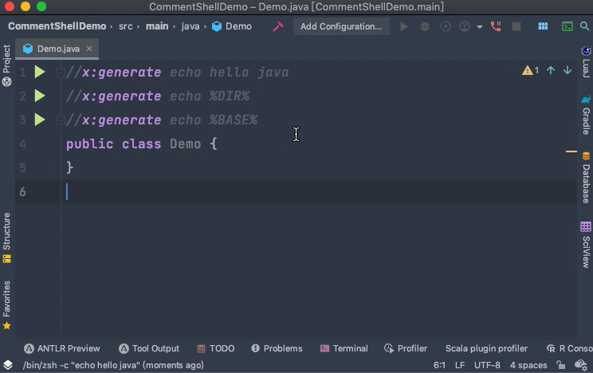

# CommentShell

[简体中文](README.MD) | English

CommentShell (CSL) a comment shell runner, which can help developers quickly execute specified commands in files without having to type shell commands in the terminal. 

For example, when developing the grpc service of golang, we need Use the protoc tool to generate pb.go.
The traditional way is to open the terminal and enter the shell command to generate the pb file after writing the proto file. 
But now, you can use CLS to replace the traditional method to improve your development efficiency, 
just in a single line comment Start with x:generate, and then add the shell commands you need to execute. 

For example, I expect to print `hello proto` through the shell command. 
You can do this with a single line comment like `//x:generate echo hello proto` .

## Supported languages (or files)

* .gitignore
* Antlr(g4)
* Api(go-zero)
* Dart
* Dockerfile
* Drools
* Gherkin
* Gradle
* Groovy
* Html
* Java
* JavaScript
* JFlex
* JSPX
* Kotlin
* Lua
* Markdown
* Perl
* PHP
* Properties
* Proto
* Python
* R
* React
* Ruby
* Rust
* Scala
* SQl
* TypeScript
* Vue
* XML
* YAML

The above languages or files have been tested. In addition, as long as the programming language 
or a certain type of file supports single-line comment grammar and specifies the single-line 
comment type and grammar writing specification theory, it can be used (see below).

## Supported Comment Style
* Java Style
    ```text
    //x:generate echo hello java
    ```
* Yaml Style
    ```text
    #x:generate echo hello yaml
    ```
* SQL Style
    ```text
    --x:generate echo hello sql
    ```
* xml/html Style
    ```text
    <!--x:generate echo hello xml-->
    ```
## Rules

### Syntax

```text
[linePrefix]x:generate [shell] [arg...] [lineSuffix]
```
* `linePrefix` is the start mark of single-line comment, only supported `//`，`#`，`--`，`<!--`
* `lineSuffix` is the end mark of single-line comment, only supported `-->` which is the end comment tag in xml/html.
* `x:generate` is keyword

**NOTE**
* There is no leading between `linePrefix` and `x:generate`.

### Constant
* `%DIR%` the directory of the target file，eg:`/foo/bar`
* `%FILENAME%` the path of the target file，gg：`/foo/bar/foobar.txt`
* `%PERCENT_SIGN%` the percent sign `%`
* `"%BASE%"` the base name of the target file，eg：`foobar.txt`

### Demo
* Print `hello java` in java file
    ```text
    //x:generate echo hello java
    ```
  Output:
    ```text
    hello java
    ```
* Generate pb.go in proto file
    ```text
    //x:generate protoc --go_out=plugins=grpc:. %FILENAME%
    ```
* Print `$PATH` in java file
    ```text
    //x:generate echo $PATH
    ```

## GIF

